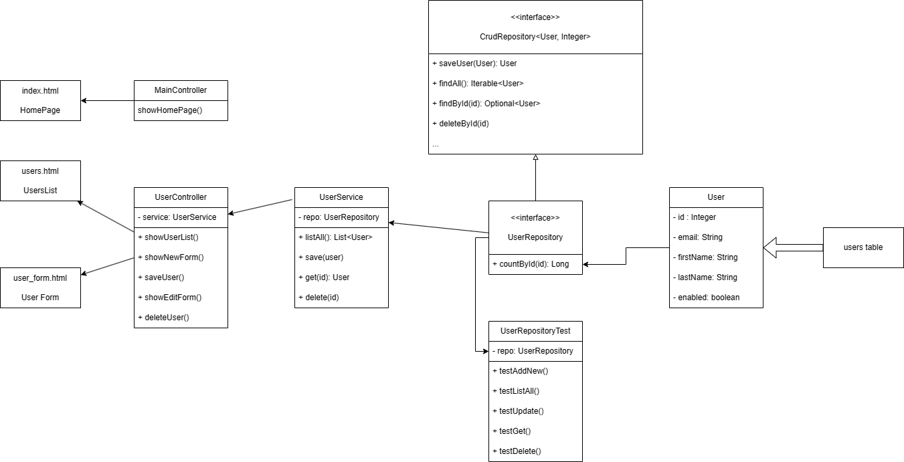

# Các bước thực hiện

## Sơ đồ tổng quan



## 1. Khởi tạo Spring Boot Project
### 1.1. Sử dụng các dependencies
- Spring Web
- Spring Data JPA
- Thymeleaf
- MySQL JDBC Driver
- Spring Boot DevTools (for automatic reload changes)

### 1.2. Tạo database schema

Cài đặt Mysql và Portainer với Docker trong WSL.

File `docker-compose.yml` như sau:

```yaml
version: '3.7'

services:
  mysql:
    image: mysql:latest
    restart: always
    environment:
      MYSQL_ROOT_PASSWORD: abc123-
      MYSQL_DATABASE: usersdb
    ports:
      - "3306:3306"
    volumes:
      - mysql_data:/var/lib/mysql

  portainer:
    image: portainer/portainer-ce:latest
    restart: always
    ports:
      - "9000:9000"
    volumes:
      - /var/run/docker.sock:/var/run/docker.sock
      - portainer_data:/data

volumes:
  mysql_data:
  portainer_data:
```


### 1.3. Cài đặt config datasource trong application.properties

Config này giúp kết nối với database.

```bash
spring.application.name=mywebapp
spring.datasource.url=jdbc:mysql://localhost:3306/usersdb
spring.datasource.username=root
spring.datasource.password=abc123-
spring.jpa.hibernate.ddl-auto=update
spring.jpa.properties.hibernate.show_sql=true
```

## 2. Code User Entity Class

Sau khi khởi tạo xong database, ta sẽ bắt đầu xác định Entity User có những field nào.

```java
public class User {
    private Integer id;

    private String email;

    private String password;

    private String firstName;

    private String lastName;

    private boolean isEnabled;
}
```

## 3. UserRepository Interface

**UserRepository là interface extend CRUDRepository**

Trong ví dụ đơn giản này ta có thể chỉ cần dùng tới *CRUDRepository* là đủ.


## 4. Code UserRepostoryTests (unit test for data access layer)

***Hãy nhớ, luôn luôn tạo unit test***

### 4.1. Test chức năng Create

- Tạo mới một `user` rồi lưu vào với `repo.save(user)`.
- Kiểm tra xem `user` vừa có tồn tại hay không.

### 4.2. Test chức năng Read

#### Kiểm tra `findAll()`

- Duyệt qua và in ra tất cả user có trong repo.

#### Kiểm tra `findById()`

- Lấy ra một `user` dựa trên `Id`.
- Kiểm tra xem `user` có tồn tại hay không.

### 4.3. Test chức năng Update

- Lấy ra `user` dựa trên `Id`.
- Thay đổi giá trị của một field bất kì.
- Lưu lại.
- Kiểm tra xem giá trị vừa thay đổi có đúng hay không.

### 4.4. Test chức năng Delete

- Xóa một `user` dựa trên `Id`.
- Kiểm tra lại xem `user` đó còn tồn tại trong repo hay không.

## 5. Code Users Listing Page
### 5.1. Read - GET: Hiển thị danh sách người dùng
- Tạo method `listAll()` trong Service trả về toàn bộ `user`.
- Tạo method `getListPage()` để lấy trang danh sách người dùng với `@GetMapping("/users")`.
- Tạo một trang `list-users.html` hiển thị danh sách `user` dưới dạng bảng, sử dụng Bootstrap.
- Lấy ra toàn bộ của `user`, sau đó gán vào `model`.
- Trải dữ liệu lên thymeleaf.

## 6. Code Add User Function
### 6.1. Create - GET: Hiển thị trang thêm mới người dùng

- Tạo method `getNewUserPage()` để hiển thị page thêm mới với `@GetMapping("/users/new")`.
- Tạo một trang `user-form.html` với các `input` tương ứng với các field của `User`.
- Thuộc tính `action` của `<form>` sẽ là đường dẫn về `/users/new`, thuộc tính `method = "post"` sẽ tương ứng với `@PostMapping` dưới đây.

### 6.2. Create - POST: Lưu người dùng mới

- Tạo method `save()` trong Service để thêm mới `user`.
- Tạo method `saveNewUser()` để lưu `user` mới với `@PostMapping("/users/save")`.

## 7. Code Update User Function
### 7.1. Update - GET: Hiển thị trang chỉnh sửa thông tin người dùng

- Tạo method `getUserById()` trong Service để lấy ra được `user` cần tìm dựa trên `id`.
- Lưu ý cần tạo `Exception` cho method này trong trường hợp `id` nhập vào không đúng hoặc không tồn tại `user` nào với `id` đó. Cụ thể sẽ là `RuntimeException`.
- Tạo method `getEditUserPage()` trong Controller, nếu lấy ra được `user` với `id` truyền vào thì ta trải dữ liệu này lên `user-form.html` ở trên. 
- Sự khác nhau giữa `getNewUserPage()` và `getEditUserPage()` khi dùng chung `user-form.html` ở chỗ ta sẽ có thêm thẻ `<input type="hidden" th:field="*{id}">`. Lúc này nếu `id` là rỗng thì có nghĩa tạo mới, còn nếu `id` có tồn tại thì các field khác cũng được hiển thị.

### 7.2. Update - POST: Cập nhật thông tin người dùng

- Tạo method `editUser()` trong Controller với `@PostMapping("users/edit/{id}")`.
- Sử dụng luôn method `save()` ở trên cũng để lưu `user` đã sửa đổi.

## 8. Code Delete User Function

- Tạo method `deleteUser()` trong Service.
- Tạo method `deleteUser()` trong Controller để thực hiện tác vụ xóa thông qua `@GetMapping("users/delete/{id}")`.